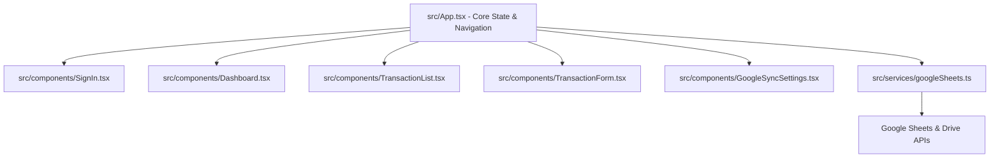

# WealthFlow — Personal Finance Tracker

WealthFlow is a premium, secure, and serverless personal finance tracking application. It operates entirely client-side, storing financial transactions in the browser's local storage and optionally syncing them directly to your personal **Google Sheets** via **Google Drive API**. 

No financial data ever touches a third-party server — everything stays strictly inside your browser and your private Google account.

---

## Key Features

- **Dynamic Financial Dashboard**: Visualizes income, expenses, net savings, and category distribution using interactive charts.
- **Google Sheets Synchronization**: Connects seamlessly with Google Drive to store, read, and append transactions to a dedicated spreadsheet (`WealthFlow Finance Tracker`).
- **Offline / Local Mode**: Fully functional offline without signing into Google, using local storage.
- **Robust Transaction Management**: Detailed logs with filtering by month, type, and category, plus pagination and quick delete actions.
- **Secure Architecture**: Serverless OAuth2 token flow where authentication is initiated using Google Identity Services (GIS).
- **Data Export & Portability**: Export your local financial data as a structured JSON file at any time, or reset database states.

---

## Codebase Architecture



### 1. Main Entry & Orchestration
* **[src/App.tsx](file:///home/chakradhar/Antigravity/financeTrack/src/App.tsx)**: The main orchestrator. It manages active views, handles local storage state, holds active user session objects (`SyncStatus`), and triggers background synchronization flows.
* **[src/main.tsx](file:///home/chakradhar/Antigravity/financeTrack/src/main.tsx)**: Entry point that mounts the React application under the root element.

### 2. Services & Integration
* **[src/services/googleSheets.ts](file:///home/chakradhar/Antigravity/financeTrack/src/services/googleSheets.ts)**: Encapsulates all Google API communication:
  * `requestGoogleAuthToken`: Handshakes with the Google Identity Services client using the configured Client ID.
  * `findOrCreateSpreadsheet`: Queries the user's Google Drive for a spreadsheet named `WealthFlow Finance Tracker`. If not found, it creates a new spreadsheet and initializes headers.
  * `fetchTransactionsFromSheet`: Pulls all transaction rows and normalizes them into structured TypeScript objects.
  * `appendTransactionsToSheet`: Appends newly added offline/unsynced transactions.

### 3. Core UI Components
* **[src/components/Dashboard.tsx](file:///home/chakradhar/Antigravity/financeTrack/src/components/Dashboard.tsx)**: Calculates metrics and renders charts (Area chart for monthly cash flow, Pie chart for expenses distribution) using `recharts`.
* **[src/components/TransactionList.tsx](file:///home/chakradhar/Antigravity/financeTrack/src/components/TransactionList.tsx)**: Renders the transaction ledger. Includes filters for type, category, and date, along with adaptive desktop-table and mobile-card list layouts.
* **[src/components/TransactionForm.tsx](file:///home/chakradhar/Antigravity/financeTrack/src/components/TransactionForm.tsx)**: Overlay modal for adding income and expense entries with inline verification checks.
* **[src/components/SignIn.tsx](file:///home/chakradhar/Antigravity/financeTrack/src/components/SignIn.tsx)**: Onboarding gateway. Handles Google Authentication, offers local offline continuation, and provides step-by-step instructions for OAuth registration.
* **[src/components/GoogleSyncSettings.tsx](file:///home/chakradhar/Antigravity/financeTrack/src/components/GoogleSyncSettings.tsx)**: Settings dashboard for account details, manual data synchronizations, local data resets, and JSON backup exports.

---

## Security & API Configuration

Because WealthFlow is purely client-side, **no Client Secret is needed or stored**. 

To use Google Sheets Sync in your deployment:
1. Go to the [Google Cloud Console](https://console.cloud.google.com).
2. Create a project and enable the **Google Sheets API** and **Google Drive API**.
3. Create an **OAuth Client ID** for a **Web Application**.
4. Register your Authorized JavaScript Origins (e.g. `http://localhost:5173` and your deployment domain).
5. In your production build, supply this client ID via the environment variable:
   ```env
   VITE_GOOGLE_CLIENT_ID=your-client-id-here.apps.googleusercontent.com
   ```
   *If the environment variable is not set, users can manually paste their Client ID inside the settings/sign-in screen, which will be saved in their local browser environment.*

---

## Development & Build Commands

Initialize dependencies:
```bash
npm install
```

Start the local development server:
```bash
npm run dev
```

Build the optimized production package:
```bash
npm run build
```
The output will compile into the `dist` directory, ready to be hosted on Netlify, Vercel, or GitHub Pages.
